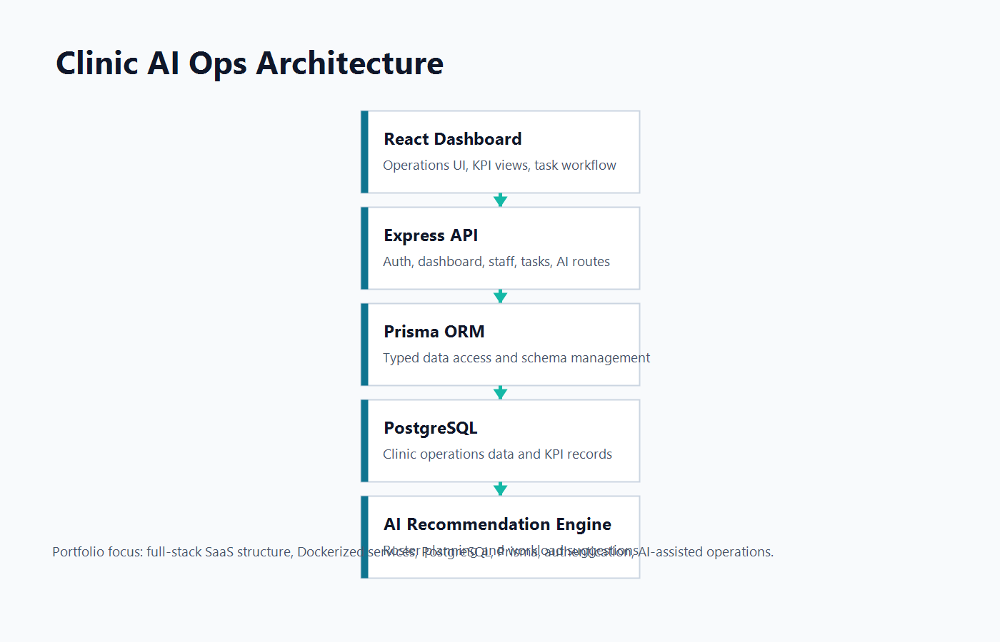

# Clinic AI Ops

Clinic AI Ops is a full-stack SaaS-style portfolio project for clinic operations: appointment visibility, staff allocation, KPI tracking, authentication, and AI-assisted recommendations.

It is structured as one product repository so reviewers can inspect the frontend, backend, database schema, Docker setup, and architecture docs in one place.

## Architecture



```text
React Dashboard
  -> Node.js / Express API
  -> PostgreSQL
  -> Prisma ORM
  -> AI Recommendation Engine
```

## Tech Stack

| Layer | Technology |
| --- | --- |
| Frontend | React, TypeScript, Vite, Tailwind CSS, Recharts |
| Backend | Node.js, Express, TypeScript |
| Database | PostgreSQL 17 |
| ORM | Prisma |
| Auth | JWT, bcryptjs |
| Testing | Vitest, Supertest, Testing Library |
| DevOps | Docker Compose |

## Project Structure

```text
clinic-ai-ops/
├── frontend/
│   ├── src/
│   ├── package.json
│   └── Dockerfile
├── backend/
│   ├── prisma/
│   ├── src/
│   ├── package.json
│   └── Dockerfile
├── docs/
│   ├── architecture.png
│   ├── er-diagram.png
│   └── api-flow.png
├── docker-compose.yml
├── README.md
└── .gitignore
```

## Features

- Dashboard for branch KPIs, appointments, sales, tasks, and staff workload
- JWT authentication with password hashing
- PostgreSQL schema managed through Prisma
- Rule-based AI recommendation module for roster planning
- Task workflow for start, completion, and KPI scoring
- Unit and API tests for backend logic
- Frontend tests for UI and formatting utilities
- Docker Compose setup for local product-style deployment

## Run With Docker

```bash
docker compose up --build
```

Services:

| Service | URL |
| --- | --- |
| Frontend | http://localhost:5173 |
| Backend API | http://localhost:4000 |
| PostgreSQL | localhost:5432 |

After the containers are running, apply the Prisma schema from the backend container or locally:

```bash
cd backend
npm run db:push
```

## Run Locally

Backend:

```bash
cd backend
npm install
cp .env.example .env
npm run db:generate
npm run db:push
npm run dev
```

Frontend:

```bash
cd frontend
npm install
cp .env.example .env
npm run dev
```

## Useful Scripts

Backend:

```bash
npm run dev
npm run build
npm test
npm run db:generate
npm run db:push
```

Frontend:

```bash
npm run dev
npm run build
npm test
npm run lint
```

## API Highlights

| Method | Endpoint | Purpose |
| --- | --- | --- |
| POST | `/api/auth/register` | Create a user |
| POST | `/api/auth/login` | Login and receive JWT |
| GET | `/api/dashboard` | Fetch dashboard data |
| GET | `/api/tasks` | List tasks |
| POST | `/api/tasks/:taskId/start` | Start a task |
| POST | `/api/tasks/:taskId/complete` | Complete a task |
| POST | `/api/ai/roster` | Generate roster recommendation |
| GET | `/api/health` | Health check |

## Portfolio Signals

- Full-stack product repository
- Dockerized frontend, backend, and database
- PostgreSQL and Prisma schema
- Authentication and protected workflows
- AI recommendation feature
- Unit and integration test coverage
- Architecture, ER, and API flow documentation

## Docs

- [Architecture](docs/architecture.md)
- [ER Diagram](docs/er-diagram.md)
- [API Flow](docs/api-flow.md)
