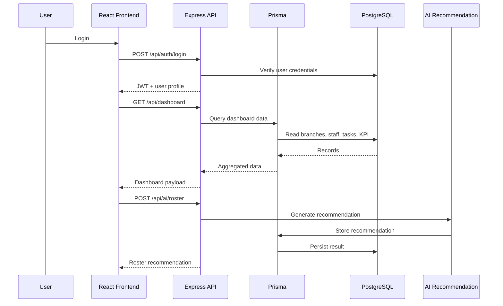

# API Flow

```mermaid
sequenceDiagram
  participant U as User
  participant F as React Frontend
  participant A as Express API
  participant P as Prisma
  participant D as PostgreSQL
  participant AI as AI Recommendation

  U->>F: Login
  F->>A: POST /api/auth/login
  A->>D: Verify user credentials
  A-->>F: JWT + user profile
  F->>A: GET /api/dashboard
  A->>P: Query dashboard data
  P->>D: Read branches, staff, tasks, KPI
  D-->>P: Records
  P-->>A: Aggregated data
  A-->>F: Dashboard payload
  F->>A: POST /api/ai/roster
  A->>AI: Generate recommendation
  AI->>P: Store recommendation
  P->>D: Persist result
  A-->>F: Roster recommendation
```
