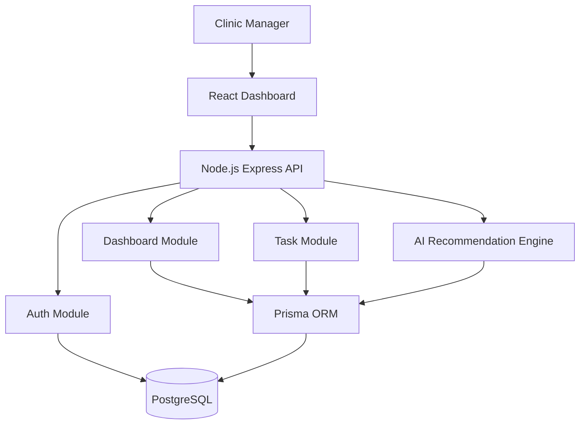

# Architecture

```mermaid
flowchart TD
  user[Clinic Manager] --> frontend[React Dashboard]
  frontend --> api[Node.js Express API]
  api --> auth[Auth Module]
  api --> dashboard[Dashboard Module]
  api --> tasks[Task Module]
  api --> ai[AI Recommendation Engine]
  auth --> db[(PostgreSQL)]
  dashboard --> prisma[Prisma ORM]
  tasks --> prisma
  ai --> prisma
  prisma --> db
```
