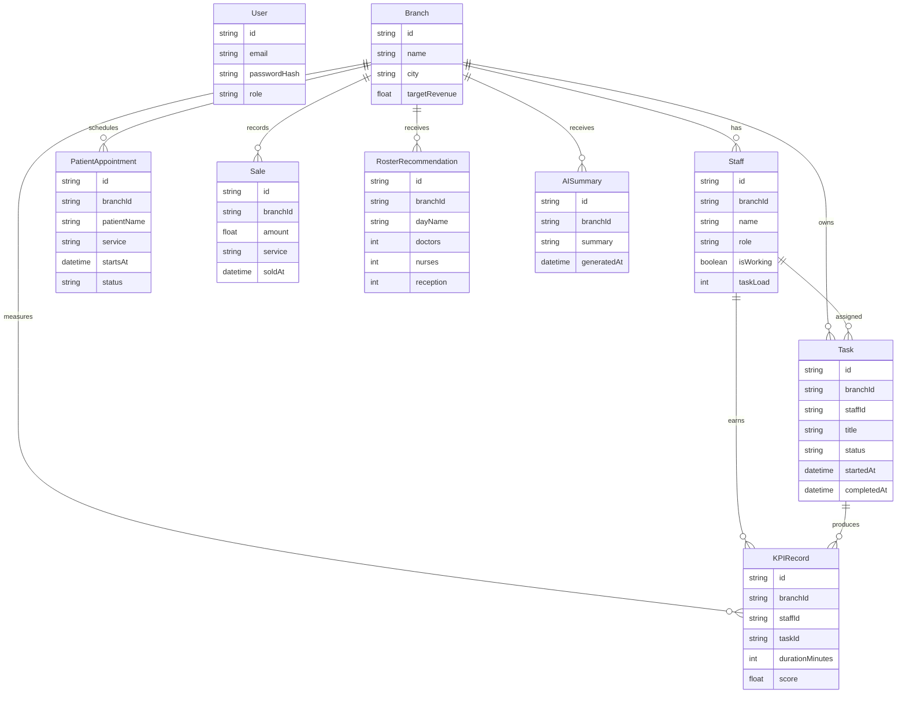

# ER Diagram

```mermaid
erDiagram
  User {
    string id
    string email
    string passwordHash
    string role
  }

  Branch {
    string id
    string name
    string city
    float targetRevenue
  }

  Staff {
    string id
    string branchId
    string name
    string role
    boolean isWorking
    int taskLoad
  }

  PatientAppointment {
    string id
    string branchId
    string patientName
    string service
    datetime startsAt
    string status
  }

  Sale {
    string id
    string branchId
    float amount
    string service
    datetime soldAt
  }

  Task {
    string id
    string branchId
    string staffId
    string title
    string status
    datetime startedAt
    datetime completedAt
  }

  KPIRecord {
    string id
    string branchId
    string staffId
    string taskId
    int durationMinutes
    float score
  }

  RosterRecommendation {
    string id
    string branchId
    string dayName
    int doctors
    int nurses
    int reception
  }

  AISummary {
    string id
    string branchId
    string summary
    datetime generatedAt
  }

  Branch ||--o{ Staff : has
  Branch ||--o{ PatientAppointment : schedules
  Branch ||--o{ Sale : records
  Branch ||--o{ Task : owns
  Branch ||--o{ KPIRecord : measures
  Branch ||--o{ RosterRecommendation : receives
  Branch ||--o{ AISummary : receives
  Staff ||--o{ Task : assigned
  Staff ||--o{ KPIRecord : earns
  Task ||--o{ KPIRecord : produces
```
